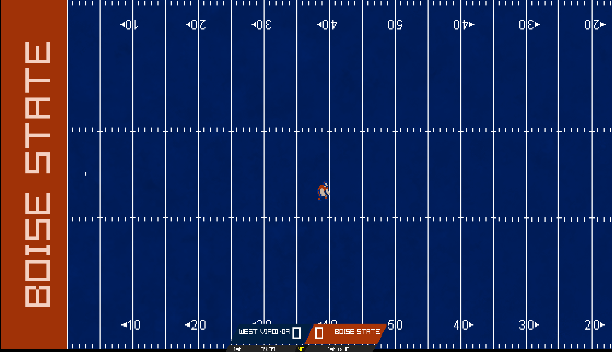
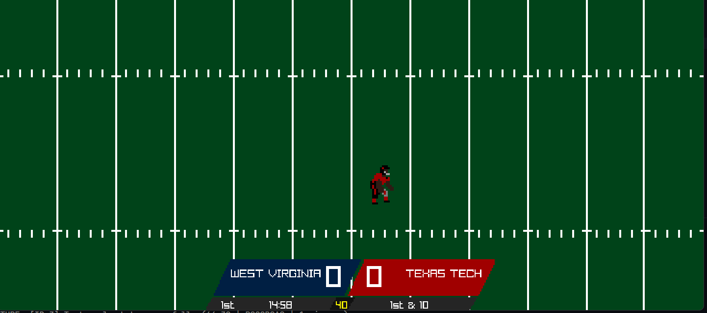
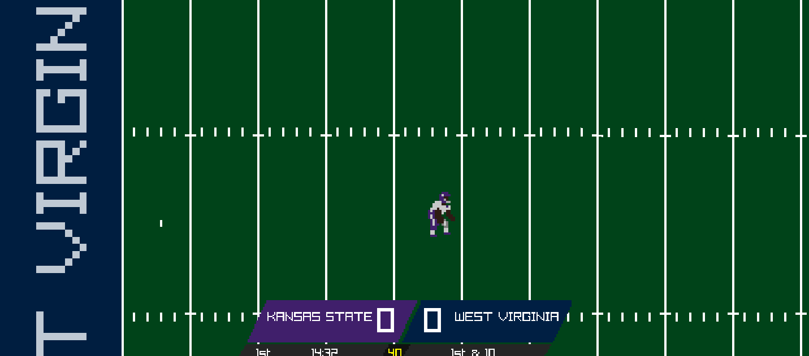
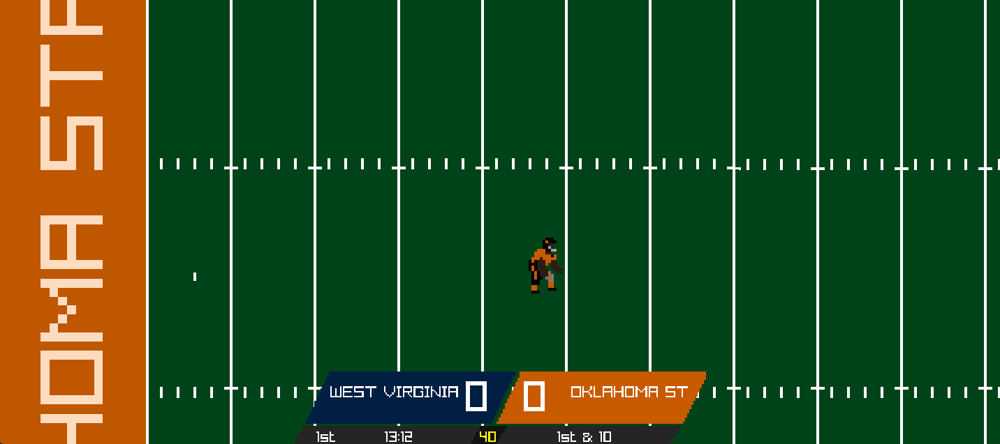

# College Football 2D

## Overview
College Football 2D is a small American football game built using Zig & Raylib.

This project is meant to be a learning experience while providing a free, open source 2D football experience for PC gamers. This project is heavily inspired by the following:
* [Retro Bowl](https://x.com/retro_bowl)
* [Tecmo Bowl](https://en.wikipedia.org/wiki/Tecmo_Bowl)

## Roadmap
This game is still extremely early in development but has plans for the following:

### Gamemodes
[ ] Exhibition
[ ] Road to Glory
[ ] Dynasty

### Misc
[x] Gamepad Support
[ ] Custom Scorebugs
[ ] Team Builder

## Screenshots

