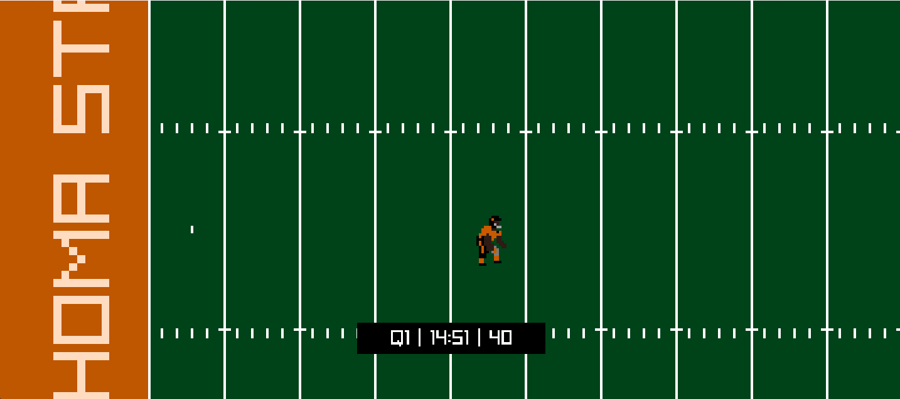
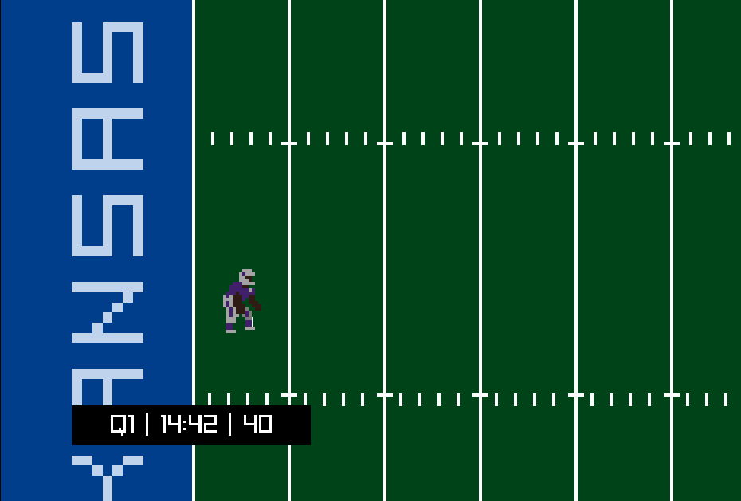

# College Football 2D

## Overview
College Football 2D is a small American football game built using Zig & Raylib.

This project is meant to be a learning experience while providing a free, open source Tecmo Bowl-like experience for PC gamers.

## Features
* Gamepad Support

## Screenshots

